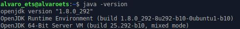
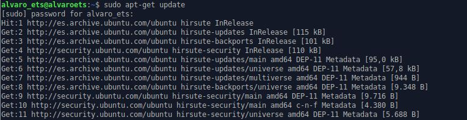
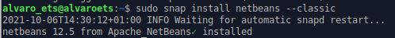

# Instalación del IDE NetBeans 12

## Requisitos

Antes de comenzar con la instalación necesitaremos tener instalado la siguiente versión de java:

## Instalación

Primero necesitamos actualizar los repositorios de Linux:

Por último, ejecutamos el comando de instalación de NetBeans:

